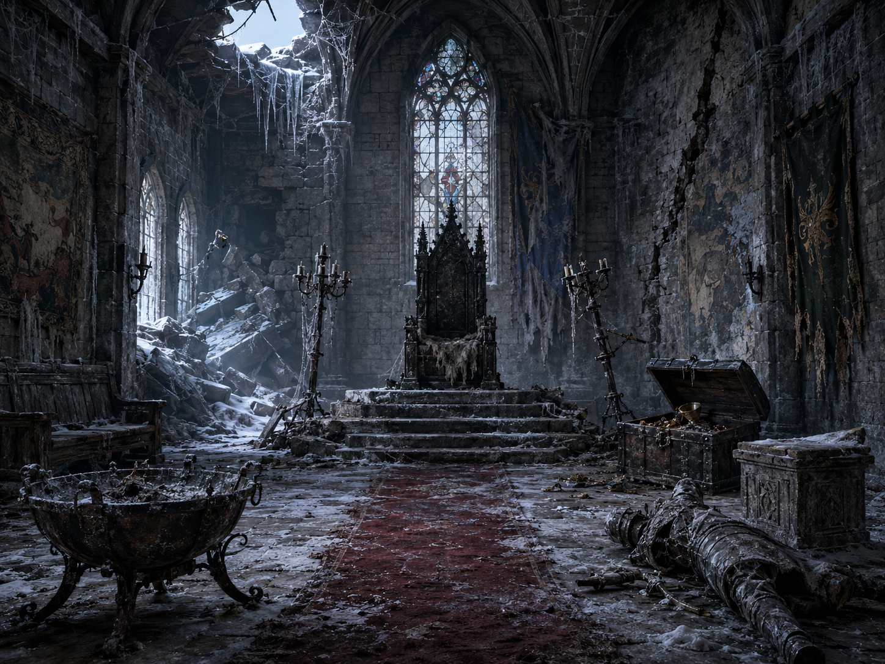
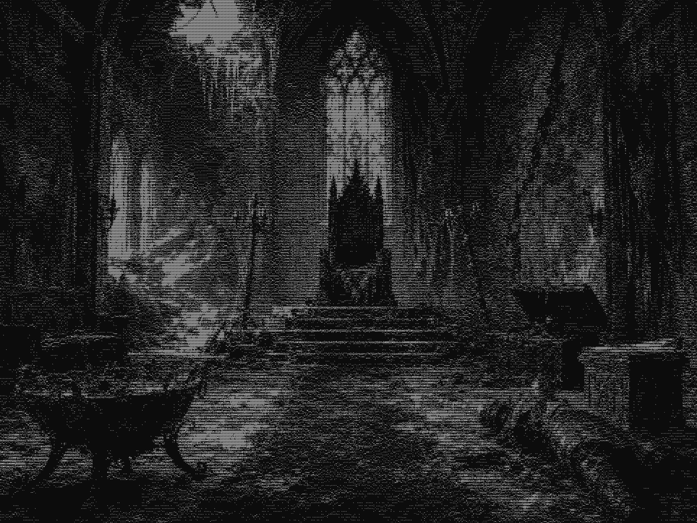

# Dungeon Generator

A procedural **dungeon-room generator**. You describe a room at a high level - a location, the
kind of room, a tone, and a few items it should contain - and a multi-step pipeline turns that
into a 3D spatial layout, a rendered image, and an ASCII rendering of the scene.

The generator does the imagining for you: it includes the items you ask for and furnishes the
rest of the room around them so it feels like a real, lived-in space.



From that image, the pipeline produces ASCII at several resolutions:



## How it works

A room flows through one deterministic-and-LLM pipeline. Each stage writes an artifact that the
next stage reads, so any stage can be re-run in isolation.

| Step | Stage | What it does |
|------|-------|--------------|
| 2 | **Creative pass** (LLM) | `location` + optional `room type` / `tone` / `required items` -> a full room spec (identity, surfaces, objects). Always adds objects beyond the required ones. |
| 3 | **Spatial layout** (LLM + engine) | Places every object into a 3D grid; a deterministic engine resolves collisions and merges grouped objects. |
| 4 | **Render** (deterministic) | A fixed pinhole camera renders a **wireframe** and a **depth map** of the room from its doorway. |
| 5 | **Image prompt** (LLM) | Assembles one image prompt describing how every object looks and where it sits in the view. |
| 6 | **Image generation** | Turns the wireframe + prompt into a finished image (see backends below). |
| 7-8 | **ASCII** (deterministic) | Greyscales the image and converts it to ASCII using perceptual luminance, at multiple resolutions. |

The **coordinate system** has its origin at the back-left floor corner (+x toward the viewer,
+y right, +z up, integer cm), and rooms come in four size presets. See [docs/](docs/) for the
design notes (room schema, presets, layout rules).

### Image-generation backends

- **OpenAI Images API (`gpt-image-1`).** Sends the wireframe as a reference image plus a prompt
  that *explains how to read it*, so the model lays the room out from the wireframe instead of
  inventing positions. Needs an `OPENAI_API_KEY`. This is the default.
- **Local Stable Diffusion + ControlNet.** SD1.5 + lineart/canny ControlNet via `diffusers`,
  tuned for an 8 GB GPU. Pixel-locks the layout more tightly but with lower content fidelity.

## Prerequisites

Most dependencies install with pip (below), but a few **cannot** - those are the usual "why
won't it run" gotchas, flagged here:

- **Python 3.11+** - a real install, not the Windows Store stub.
- **An LLM backend** for the creative/layout/prompt steps, either:
  - the **`claude` CLI** (Claude Code), installed and signed in - this is the default; *not
    pip-installable*, or
  - an **Anthropic API key** (then set `ANTHROPIC_API_KEY` and `DUNGEON_LLM_BACKEND=api`).
- **An image backend**, either:
  - an **OpenAI API key** (`OPENAI_API_KEY`) for `gpt-image-1` - the default, or
  - **local Stable Diffusion** - needs an **NVIDIA GPU (~8 GB) + CUDA**; *not pip-installable*.

Commands below use Windows / PowerShell.

## Installation

```powershell
python -m venv .venv
.\.venv\Scripts\Activate.ps1
pip install -r requirements.txt
```

Set your API key: copy `.env.example` to `.env` and fill in **`OPENAI_API_KEY`** (used for image
generation).

**For the local Stable Diffusion backend**, install the CUDA build of PyTorch *before*
`pip install -r requirements.txt` (otherwise you get the CPU-only wheel):

```powershell
pip install torch torchvision --index-url https://download.pytorch.org/whl/cu124
```

**To use the Anthropic API** instead of the `claude` CLI for the LLM steps, also set
`ANTHROPIC_API_KEY` in `.env` and `DUNGEON_LLM_BACKEND=api`.

## Quickstart

Generate a single room end-to-end:

```powershell
python examples/generate_room.py --location "a vast medieval castle" `
    --room-type "throne room" --tone "grand but decaying" `
    --items "a treasure chest, a throne"
```

Only `--location` is required. Generate a whole **set** of varied rooms into one organized
folder tree:

```powershell
python examples/generate_set.py --set my-set              # edit the SPECS list to choose rooms
python examples/generate_set.py --set my-set --no-image   # rooms + wireframes only (no image API)
```

Each room lands in `savedOutputs/sets/<set>/NN_<slug>/` with `room.json`, `wireframe.png`,
`image.png`, and ASCII at 100/200/450/800/native columns (`.txt` + `.png` preview). The set
generator is resumable - rerun it and it finishes only what's missing.

Run the tests with `pytest`.

## Project layout

```
generator/   core library (schema, geometry, placement, render, ascii, llm, image backends)
examples/    runnable entry points (generate_room, generate_set, asciify_gpt, run_pipeline)
docs/        design notes, prompt templates, and the gallery
tests/       pytest suite
```

## Notes & caveats

- On the OpenAI backend the wireframe is a strong *reference*, not a pixel-locked geometry lock
  - expect rich content with somewhat looser exact positioning.
- Your `.env` and generated artifacts (`savedOutputs/`) are gitignored and never published.

## License

[MIT](LICENSE) - Copyright (c) 2026 Anthony Safonov.
